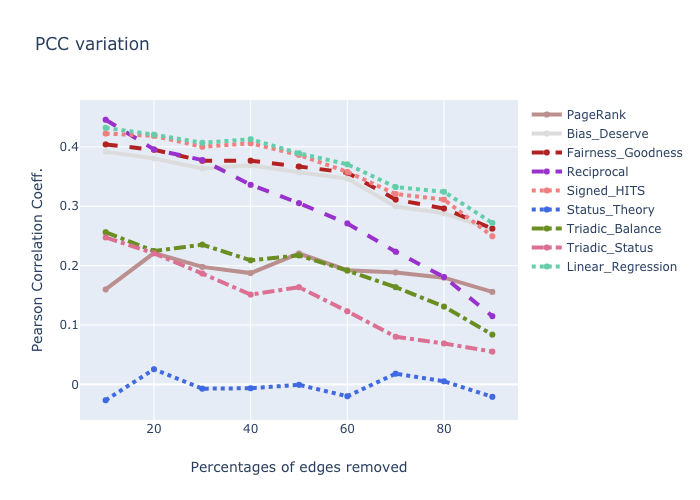
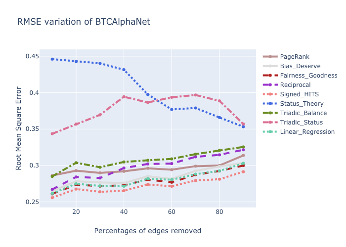

# Benchmarking Algorithms for Edge Weight Prediction in Weighted Signed Networks

CE7490 2019 Fall - Advanced Topics in Distributed System - Project 1: Online Social Network

## Installation Guide
Running the experiment requires Python3 with corresponding packages.

The project is supported on Linux and MacOS. It may be possible to install on Windows, though this hasn't been extensively tested.

### Installing Anaconda
[Anaconda](https://www.anaconda.com/distribution/) is a library that includes Python and many useful packages, as well as an environment manager called conda that makes package management simple.

Follow the official instrutions of Anaconda. Once it has been successfully installed, run the following command at terminal:

```
git clone https://github.com/RuihangWang/CE7490-OSN-Project.git
cd CE7490-Group-Project-Python
conda env create -f environment.yml
```

To use Python from the environment you just created, activate the environment with

```
conda activate CE7490-OSN-Project
```

### Check Your Install
To see if you've successfully activated environment, try to run 'test.py' with

```
python test.py
```

The outputs should be [0.13, 0.08, -0.14, -0.33, 0.73, -1]

## Running Experiments

The standard way to run the benchmark algorithms from command line is:

```
cd exp
python ex1.py 
python ex2.py 
```
ex1.py is for leaving one edge out prediction of a common set of algorithms.

ex2.py is for leaving N% edge out prediction of a common set of algorithms.

## Plotting Results
To plot the results, run the following command:

```
cd exp
python plot.py
```

The figures are shown like this:




## Avaliable dataset
When running the experiments, the currently avaliable datasets are stored in '../dataset'. Additional datasets can be downloaded from https://cs.stanford.edu/~srijan/wsn/data/data-wsn.zip
